# 第二章、物理层

## 2.1  物理层的基本概念

物理层考虑的是怎样才能在连接各种计算机的传输媒体上传输数据比特流，而不是指具体的传输媒体。

物理层的作用是要尽可能地屏蔽掉不同传输媒体和通信手段的差异。

用于物理层的协议也常称为物理层规程 (procedure)。

**物理层的主要任务**

<u>主要任务：确定与传输媒体的接口的一些特性。</u>

机械特性 ：指明接口所用接线器的形状和尺寸、引线数目和排列、固定和锁定装置等。
电气特性：指明在接口电缆的各条线上出现的电压的范围。
功能特性：指明某条线上出现的某一电平的电压表示何种意义。
过程特性 ：指明对于不同功能的各种可能事件的出现顺序。 

## 2.2  数据通信的基础知识

### 2.2.1  数据通信系统的模型

<u>一个数据通信系统包括三大部分：源系统（或发送端、发送方）、传输系统（或传输网络）和目的系统（或接收端、接收方）。</u>

**常用术语**

数据 (data) —— 运送消息的实体。
信号 (signal) —— 数据的电气的或电磁的表现。 
模拟信号 (analogous signal) —— 代表消息的参数的取值是连续的。 
数字信号 (digital signal) —— 代表消息的参数的取值是离散的。 
码元 (code) —— 在使用时间域（或简称为时域）的波形表示数字信号时，代表不同离散数值的基本波形。

### 2.2.2  有关信道的几个基本概念

信道 —— 一般用来表示向某一个方向传送信息的媒体。
单向通信（单工通信）——只能有一个方向的通信而没有反方向的交互。
双向交替通信（半双工通信）——通信的双方都可以发送信息，但不能双方同时发送(当然也就不能同时接收)。
双向同时通信（全双工通信）——通信的双方可以同时发送和接收信息。 

基带信号（即基本频带信号）—— 来自信源的信号。像计算机输出的代表各种文字或图像文件的数据信号都属于基带信号。
基带信号往往包含有较多的低频成分，甚至有直流成分，而许多信道并不能传输这种低频分量或直流分量。因此必须对基带信号进行调制 (modulation)。   

调制分为两大类：

基带调制：仅对基带信号的波形进行变换，使它能够与信道特性相适应。变换后的信号仍然是基带信号。把这种过程称为编码 (coding)。

带通调制：使用载波 (carrier)进行调制，把基带信号的频率范围搬移到较高的频段，并转换为模拟信号，这样就能够更好地在模拟信道中传输（即仅在一段频率范围内能够通过信道） 。

带通信号 ：经过载波调制后的信号。

#### (1) 常用编码方式

不归零制：正电平代表 1，负电平代表 0。
归零制：正脉冲代表 1，负脉冲代表 0。
曼彻斯特编码：位周期中心的向上跳变代表 0，位周期中心的向下跳变代表 1。但也可反过来定义。
差分曼彻斯特编码：在每一位的中心处始终都有跳变。位开始边界有跳变代表 0，而位开始边界没有跳变代表 1。

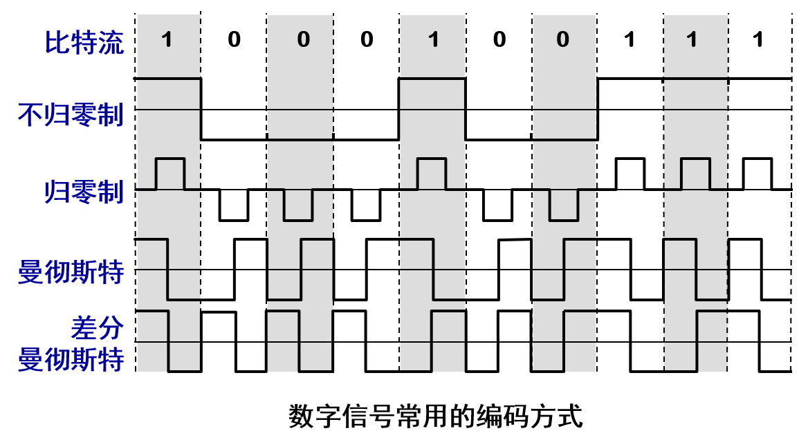

从信号波形中可以看出，曼彻斯特 (Manchester) 编码和差分曼彻斯特编码产生的信号频率比不归零制高。
从自同步能力来看，不归零制不能从信号波形本身中提取信号时钟频率（这叫作没有自同步能力），而曼彻斯特编码和差分曼彻斯特编码具有自同步能力。

#### (2) 基本的带通调制方法

- 基带信号往往包含有较多的低频成分，甚至有直流成分，而许多信道并不能传输这种低频分量或直流分量。为了解决这一问题，就必须对基带信号进行调制 (modulation)。 
- 最基本的二元制调制方法有以下几种：
  - 调幅(AM)：载波的振幅随基带数字信号而变化。 
  - 调频(FM)：载波的频率随基带数字信号而变化。
  - 调相(PM) ：载波的初始相位随基带数字信号而变化。  

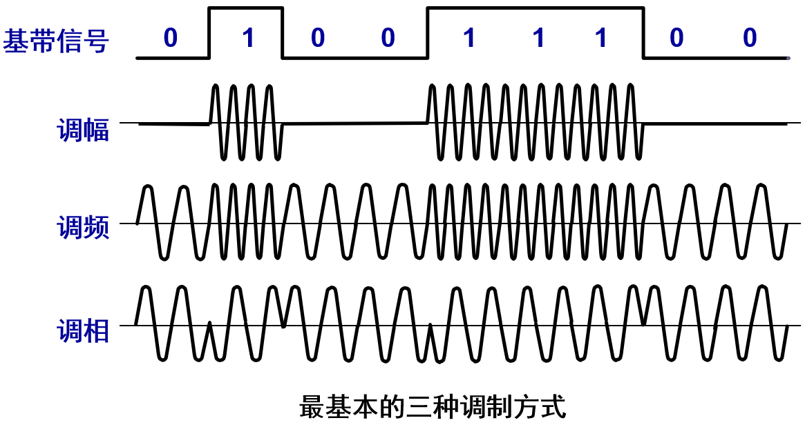

正交振幅调制 QAM(Quadrature Amplitude Modulation) 

**举例**

为了达到更高的信息传输速率，必须采用技术上更为复杂的多元制的振幅相位混合调制方法。

例如：
可供选择的相位有 12 种，而对于每一种相位有 1 或 2 种振幅可供选择。总共有 16 种组合，即 16 个码元。
由于 4 bit 编码共有 16 种不同的组合，因此这 16 个点中的每个点可对应于一种 4 bit 的编码。数据传输率可提高 4 倍。 

不是码元越多越好。若每一个码元可表示的比特数越多，则在接收端进行解调时要正确识别每一种状态就越困难，出错率增加。 

### 2.2.3  信道的极限容量

任何实际的信道都不是理想的，在传输信号时会产生各种失真以及带来多种干扰。 

码元传输的速率越高，或信号传输的距离越远，或传输媒体质量越差，在信道的输出端的波形的失真就越严重。 

**数字信号通过实际的信道** 

从概念上讲，限制码元在信道上的传输速率的因素有以下两个：

- 信道能够通过的频率范围
- 信噪比

#### (1) 信道能够通过的频率范围

具体的信道所能通过的频率范围总是有限的。信号中的许多高频分量往往不能通过信道。
1924年，奈奎斯特 (Nyquist) 就推导出了著名的奈氏准则。他给出了在假定的理想条件下，为了避免码间串扰，码元的传输速率的上限值。

<u>在任何信道中，码元传输的速率是有上限的，否则就会出现码间串扰的问题，使接收端对码元的判决（即识别）成为不可能。</u>

<u>如果信道的频带越宽，也就是能够通过的信号高频分量越多，那么就可以用更高的速率传送码元而不出现码间串扰</u> 

#### (2) 信噪比 

噪声存在于所有的电子设备和通信信道中。
噪声是随机产生的，它的瞬时值有时会很大。因此噪声会使接收端对码元的判决产生错误。
但噪声的影响是相对的。如果信号相对较强，那么噪声的影响就相对较小。
信噪比就是信号的平均功率和噪声的平均功率之比。常记为 S/N，并用分贝 (dB) 作为度量单位。即：
		信噪比(dB) = 10 log10(S/N)    (dB) 
例如，当 S/N = 10 时，信噪比为 10 dB，而当 S/N = 1000时，信噪比为 30 dB。  

1984年，香农 (Shannon) 用信息论的理论推导出了带宽受限且有高斯白噪声干扰的信道的极限、无差错的信息传输速率（香农公式）。
信道的极限信息传输速率 C 可表达为：
		C = W log2(1+S/N)    (bit/s) 
其中：	W 为信道的带宽（以 Hz 为单位）；
		S 为信道内所传信号的平均功率；
		N 为信道内部的高斯噪声功率。  

**香农公式表明** 

信道的带宽或信道中的信噪比越大，则信息的极限传输速率就越高。 

只要信息传输速率低于信道的极限信息传输速率，就一定可以找到某种办法来实现无差错的传输。 

若信道带宽 W 或信噪比 S/N 没有上限（当然实际信道不可能是这样的），则信道的极限信息传输速率 C 也就没有上限。

实际信道上能够达到的信息传输速率要比香农的极限传输速率低不少。  

**请注意** 

对于频带宽度已确定的信道，如果信噪比不能再提高了，并且码元传输速率也达到了上限值，那么还有办法提高信息的传输速率。
这就是：用编码的方法让每一个码元携带更多比特的信息量。 

## 2.3  物理层下面的传输媒体

传输媒体也称为传输介质或传输媒介，它就是数据传输系统中在发送器和接收器之间的物理通路。
传输媒体可分为两大类，即导引型传输媒体和非导引型传输媒体。
在导引型传输媒体中，电磁波被导引沿着固体媒体（铜线或光纤）传播。
非导引型传输媒体就是指自由空间。在非导引型传输媒体中，电磁波的传输常称为无线传输。

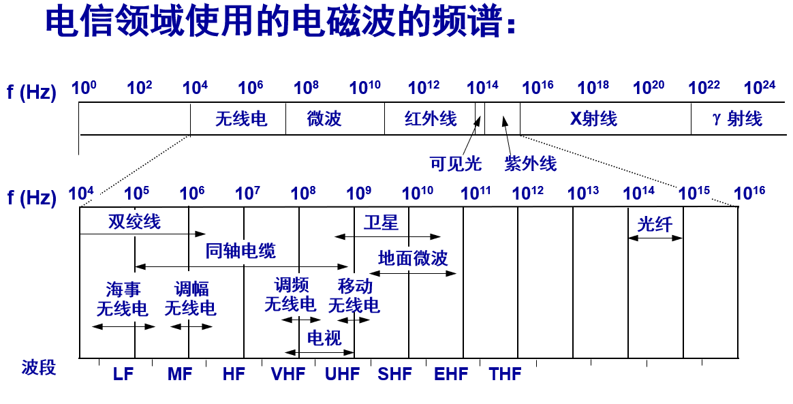

### 2.3.1  导引型传输媒体

**双绞线**
最常用的传输媒体。
模拟传输和数字传输都可以使用双绞线，其通信距离一般为几到十几公里。
屏蔽双绞线 STP (Shielded Twisted Pair)
带金属屏蔽层
无屏蔽双绞线 UTP (Unshielded Twisted Pair) 

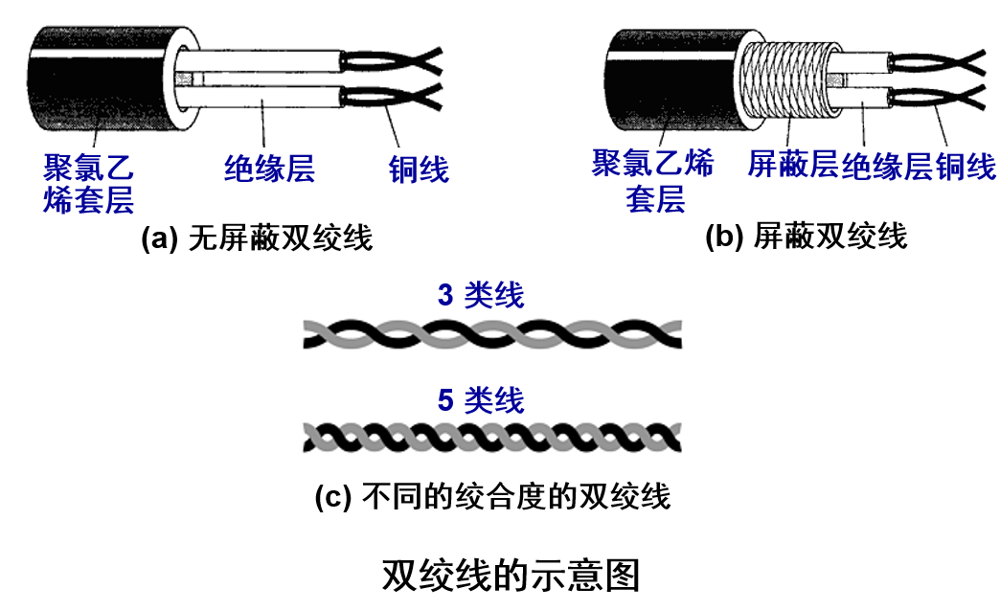

**双绞线标准**

1991年，美国电子工业协会 EIA 和电信行业协会联合发布了一个用于室内传送数据的无屏蔽双绞线和屏蔽双绞线的标准 EIA/TIA-568。
1995年将布线标准更新为 EIA/TIA-568-A。
此标准规定了 5 个种类的 UTP 标准（从 1 类线到 5 类线）。
对传送数据来说，现在最常用的 UTP 是5类线（Category 5 或 CAT5）。

**常用的绞合线的类别、带宽和典型应用**

| **绞合线类别** | **带宽** | **线缆特点**              | **典型应用**                             |
| -------------- | -------- | ------------------------- | ---------------------------------------- |
| 3              | 16  MHz  | 2对4芯双绞线              | 模拟电话；曾用于传统以太网（10  Mbit/s） |
| 4              | 20  MHz  | 4对8芯双绞线              | 曾用于令牌局域网                         |
| 5              | 100  MHz | 与4类相比增加了绞合度     | 传输速率不超过100  Mbit/s的应用          |
| 5E（超5类）    | 125  MHz | 与5类相比衰减更小         | 传输速率不超过1  Gbit/s的应用            |
| 6              | 250  MHz | 与5类相比改善了串扰等性能 | 传输速率高于1  Gbit/s的应用              |
| 7              | 600  MHz | 使用屏蔽双绞线            | 传输速率高于10 Gbit/s的应用              |

**同轴电缆**

同轴电缆具有很好的抗干扰特性，被广泛用于传输较高速率的数据。
同轴电缆的带宽取决于电缆的质量。
50 Ω同轴电缆 —— LAN / 数字传输常用
75 Ω 同轴电缆 —— 有线电视 / 模拟传输常用

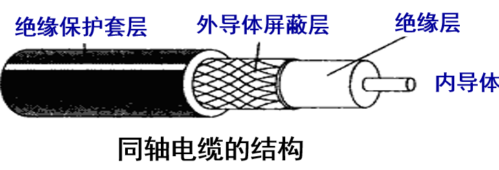

**光缆**
光纤是光纤通信的传输媒体。
由于可见光的频率非常高，约为 108 MHz 的量级，因此一个光纤通信系统的传输带宽远远大于目前其他各种传输媒体的带宽。

**光线在光纤中的折射** 

**光纤的工作原理**

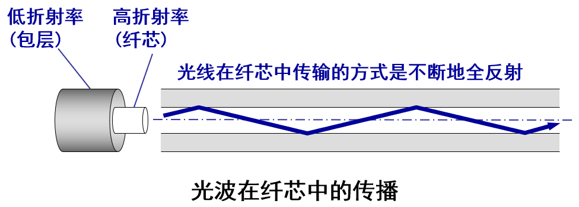

只要从纤芯中射到纤芯表面的光线的入射角大于某个临界角度，就可产生全反射。

多模光纤 
可以存在多条不同角度入射的光线在一条光纤中传输。这种光纤就称为多模光纤。
单模光纤
若光纤的直径减小到只有一个光的波长，则光纤就像一根波导那样，它可使光线一直向前传播，而不会产生多次反射。这样的光纤称为单模光纤。

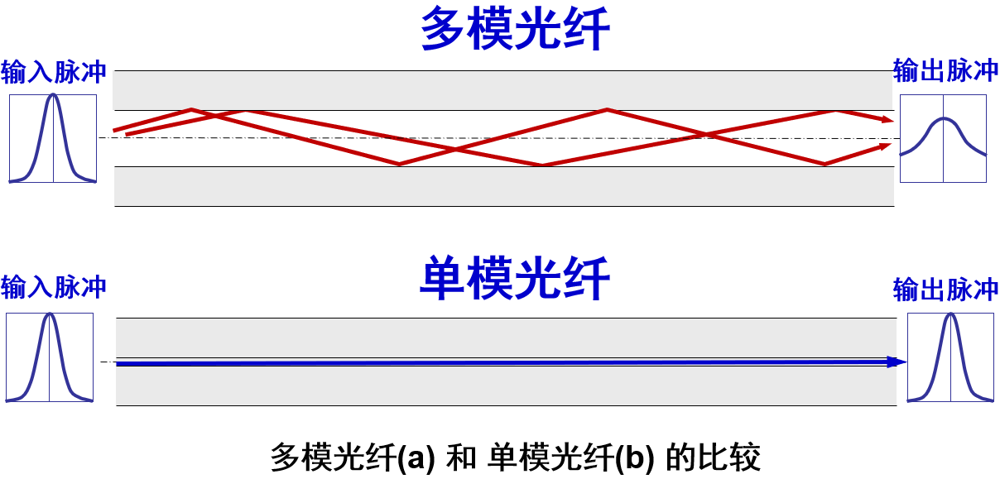

**光纤通信中使用的光波的波段**

常用的三个波段的中心分别位于 850 nm, 1300 nm 和 1550 nm。
所有这三个波段都具有 25000~30000 GHz 的带宽，可见光纤的通信容量非常大。

**光纤优点**

(1) 通信容量非常大。
(2) 传输损耗小，中继距离长。
(2) 抗雷电和电磁干扰性能好。
(3) 无串音干扰，保密性好。
(4) 体积小，重量轻。

### 2.3.2  非导引型传输媒体

- 将自由空间称为“非导引型传输媒体”。
- 无线传输所使用的频段很广。
- 短波通信（即高频通信）主要是靠电离层的反射，但短波信道的通信质量较差，传输速率低。
- 微波在空间主要是直线传播。
- 传统微波通信有两种方式：
  - 地面微波接力通信
  - 卫星通信  

  **无线局域网使用的 ISM 频段** 

要使用某一段无线电频谱进行通信，通常必须得到本国政府有关无线电频谱管理机构的许可证。但是，也有一些无线电频段是可以自由使用的。例如：ISM。各国的 ISM 标准有可能略有差别。

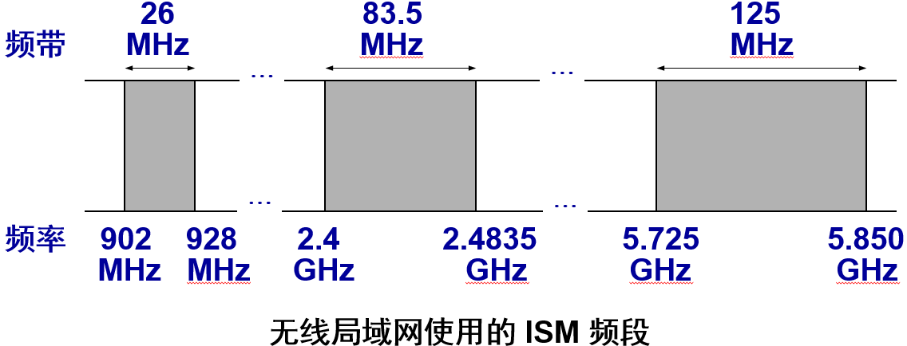

## 2.4  信道复用技术

### 2.4.1  频分复用、时分复用和统计时分复用

复用 (multiplexing) 是通信技术中的基本概念。
它允许用户使用一个共享信道进行通信，降低成本，提高利用率。

**频分复用 FDM (Frequency Division Multiplexing)** 

将整个带宽分为多份，用户在分配到一定的频带后，在通信过程中自始至终都占用这个频带。
频分复用的所有用户在同样的时间占用不同的带宽资源（请注意，这里的“带宽”是频率带宽而不是数据的发送速率）。 

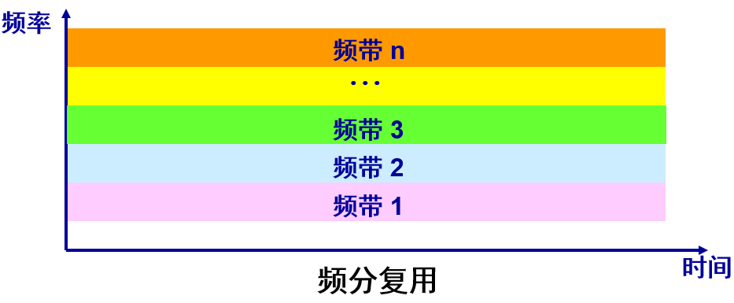

**时分复用TDM (Time Division Multiplexing) **

时分复用则是将时间划分为一段段等长的时分复用帧（TDM 帧）。每一个时分复用的用户在每一个 TDM 帧中占用固定序号的时隙。
每一个用户所占用的时隙是周期性地出现（其周期就是 TDM  帧的长度）。
TDM 信号也称为等时(isochronous)信号。
时分复用的所有用户是在不同的时间占用同样的频带宽度。

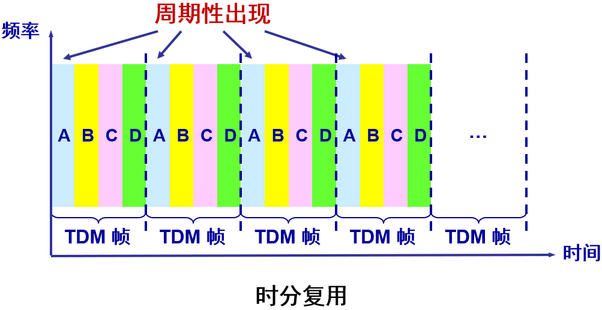

时分复用可能会造成线路资源的浪费 

使用时分复用系统传送计算机数据时，由于计算机数据的突发性质，用户对分配到的子信道的利用率一般是不高的。

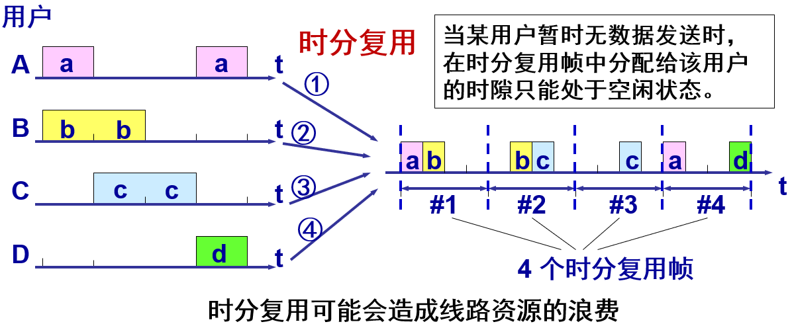

**统计时分复用 STDM (Statistic TDM)**  

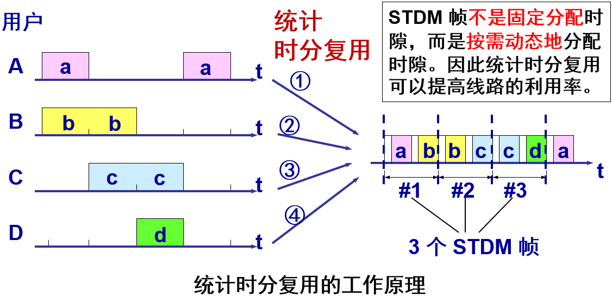

### 2.4.2  波分复用

 波分复用 WDM (Wavelength Division Multiplexing)  

波分复用就是光的频分复用。使用一根光纤来同时传输多个光载波信号。

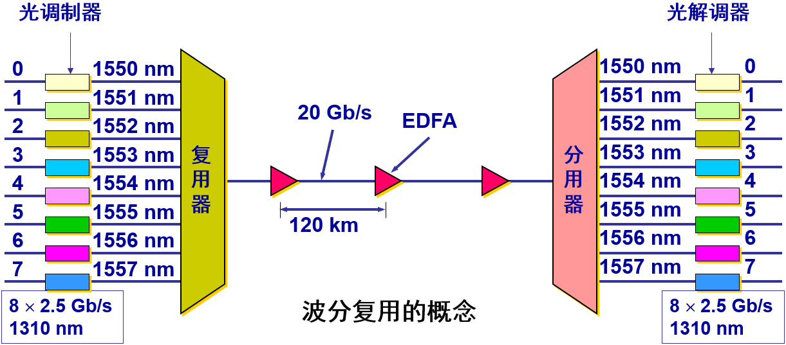

### 2.4.3  码分复用

常用的名词是码分多址 CDMA 
    (Code Division Multiple Access)。
各用户使用经过特殊挑选的不同码型，因此彼此不会造成干扰。
这种系统发送的信号有很强的抗干扰能力，其频谱类似于白噪声，不易被敌人发现。 

**码片序列(chip sequence)** 

- 每一个比特时间划分为 m 个短的间隔，称为码片 (chip)。

- 每个站被指派一个唯一的 m bit 码片序列。
  - 如发送比特 1，则发送自己的 m bit 码片序列。
  - 如发送比特 0，则发送该码片序列的二进制反码。 

- 例如，S 站的 8 bit 码片序列是 00011011。
  - 发送比特 1 时，就发送序列 00011011，
  - 发送比特 0 时，就发送序列 11100100。

- S 站的码片序列：(–1 –1 –1 +1 +1 –1 +1 +1)     

**码片序列实现了扩频**

假定S站要发送信息的数据率为 b bit/s。由于每一个比特要转换成 m 个比特的码片，因此 S 站实际上发送的数据率提高到 mb bit/s，同时 S 站所占用的频带宽度也提高到原来数值的 m 倍。
这种通信方式是扩频(spread spectrum)通信中的一种。
扩频通信通常有两大类：
	一种是直接序列扩频DSSS (Direct Sequence Spread Spectrum)，如上面讲的使用码片序列就是这一类。
	另一种是跳频扩频FHSS (Frequency Hopping Spread Spectrum)。

**CDMA 的重要特点**

每个站分配的码片序列不仅必须各不相同，并且还必须互相正交 (orthogonal)。
在实用的系统中是使用伪随机码序列。 

**码片序列的正交关系** 

令向量 S 表示站 S 的码片向量，令 T 表示其他任何站的码片向量。 
两个不同站的码片序列正交，就是向量 S 和T 的规格化内积 (inner product) 等于 0： 

**正交关系的另一个重要特性** 

任何一个码片向量和该码片向量自己的规格化内积都是 1 。

一个码片向量和该码片反码的向量的规格化内积值是 –1。 

**CDMA 的工作原理** 

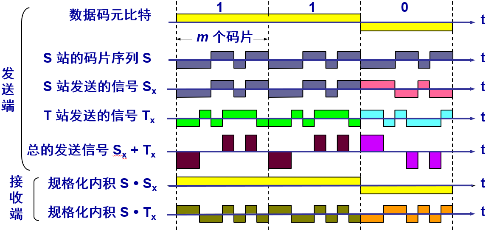

## 2.5  数字传输系统

在早期电话网中，从市话局到用户电话机的用户线是采用最廉价的双绞线电缆，而长途干线采用的是频分复用 FDM 的模拟传输方式。
与模拟通信相比，数字通信无论是在传输质量上还是经济上都有明显的优势。
目前，长途干线大都采用时分复用 PCM 的数字传输方式。
脉码调制 PCM 体制最初是为了在电话局之间的中继线上传送多路的电话。

由于历史上的原因，PCM 有两个互不兼容的国际标准：
	北美的 24 路 PCM（简称为 T1）
	欧洲的 30 路 PCM（简称为 E1）
我国采用的是欧洲的 E1 标准。
E1 的速率是 2.048 Mbit/s，而 T1 的速率是 1.544 Mbit/s。
当需要有更高的数据率时，可采用复用的方法。   

**旧的数字传输系统存在许多缺点**

最主要的是以下两个方面： 
	速率标准不统一
		如果不对高次群的数字传输速率进行标准化，国际范围的基于光纤高速数据传输就很难实现。 
	不是同步传输
		在过去相当长的时间，为了节约经费，各国的数字网主要是采用准同步方式。  
		当数据传输的速率很高时，收发双方的时钟同步就成为很大的问题。 

**同步光纤网** **SONET**

同步光纤网 SONET (Synchronous Optical Network)  的各级时钟都来自一个非常精确的主时钟。 
SONET 为光纤传输系统定义了同步传输的线路速率等级结构
	对电信信号称为第 1 级同步传送信号 STS-1 (Synchronous Transport Signal)，其传输速率是 51.84 Mbit/s。
	对光信号则称为第 1 级光载波 OC-1 (OC 表示Optical Carrier)。
现已定义了从 51.84 Mbit/s (即OC-1) 一直到 9953.280 Mbit/s (即 OC-192/STS-192) 的标准。  

 **同步数字系列 SDH** 

ITU-T 以美国标准 SONET 为基础，制订出国际标准同步数字系列 SDH (Synchronous Digital Hierarchy)。
一般可认为 SDH 与 SONET 是同义词。
其主要不同点是：SDH 的基本速率为 155.52 Mbit/s，称为第 1 级同步传递模块 (Synchronous Transfer Module)，即 STM-1，相当于 SONET 体系中的 OC-3 速率。   

**SONET的 OC级 / STS级 与SDH的 STM级 的对应关系**

| 线路速率  (Mb/s) | SONET  符号    | ITU-T  符号 | 表示线路速率  的常用近似值 |
| ---------------- | -------------- | ----------- | -------------------------- |
| 51.840           | OC-1/STS-1     | ¾           |                            |
| 155.520          | OC-3/STS-3     | STM-1       | 155 Mbit/s                 |
| 466.560          | OC-9/STS-9     | STM-3       |                            |
| 622.080          | OC-12/STS-12   | STM-4       | 622 Mbit/s                 |
| 933.120          | OC-18/STS-18   | STM-6       |                            |
| 1244.160         | OC-24/STS-24   | STM-8       |                            |
| 2488.320         | OC-48/STS-48   | STM-16      | 2.5 Gbit/s                 |
| 4976.640         | OC-96/STS-96   | STM-32      |                            |
| 9953.280         | OC-192/STS-192 | STM-64      | 10 Gbit/s                  |
| 39813.120        | OC-768/STS-768 | STM-256     | 40 Gbit/s                  |

**SONET / SDH** **标准的意义**

使不同的数字传输体制在 STM-1 等级上获得了统一。
第一次真正实现了数字传输体制上的世界性标准。
已成为公认的新一代理想的传输网体制。
SDH 标准也适合于微波和卫星传输的技术体制。

## 2.6  宽带接入技术

用户要连接到互联网，必须先连接到某个 ISP。
在互联网的发展初期，用户都是利用电话的用户线通过调制解调器连接到 ISP 的，电话用户线接入到互联网的速率最高只能达到 56 kbit/s。
美国联邦通信委员会 FCC 认为只要双向速率之和超过 200 kbit/s 就是宽带。

从宽带接入的媒体来看，可以划分为两大类：
	有线宽带接入
	无线宽带接入
下面讨论有线的宽带接入。

#### 2.6.1  ADSL 技术

非对称数字用户线 ADSL (Asymmetric Digital Subscriber Line) 技术就是用数字技术对现有的模拟电话用户线进行改造，使它能够承载宽带业务。

标准模拟电话信号的频带被限制在 300~3400 Hz 的范围内，但用户线本身实际可通过的信号频率仍然超过 1 MHz。

ADSL 技术就把 0~4 kHz 低端频谱留给传统电话使用，而把原来没有被利用的高端频谱留给用户上网使用。

DSL 就是数字用户线 (Digital Subscriber Line) 的缩写。

**DSL 的几种类型** 

ADSL (Asymmetric Digital Subscriber Line)：非对称数字用户线
HDSL (High speed DSL)：高速数字用户线
SDSL (Single-line DSL)：1 对线的数字用户线
VDSL (Very high speed DSL)：甚高速数字用户线
DSL (Digital Subscriber Line) ：数字用户线。
RADSL (Rate-Adaptive DSL)：速率自适应 DSL，是 ADSL 的一个子集，可自动调节线路速率）。 

**ADSL 的传输距离**

ADSL 的传输距离取决于数据率和用户线的线径（用户线越细，信号传输时的衰减就越大）。
ADSL 所能得到的最高数据传输速率与实际的用户线上的信噪比密切相关。
例如：
	0.5 毫米线径的用户线，传输速率为 1.5 ~ 2.0 Mbit/s 时可传送 5.5 公里，但当传输速率提高到 6.1 Mbit/s 时，传输距离就缩短为 3.7 公里。
	如果把用户线的线径减小到 0.4 毫米，那么在 6.1 Mbit/s 的传输速率下就只能传送 2.7 公里。

**ADSL 的特点**

上行和下行带宽做成不对称的。
	上行指从用户到 ISP，而下行指从 ISP 到用户。
ADSL 在用户线（铜线）的两端各安装一个 ADSL 调制解调器。
我国目前采用的方案是离散多音调 DMT (Discrete Multi-Tone)调制技术。
	这里的“多音调”就是“多载波”或“多子信道”的意思。

**DMT 技术**

DMT 调制技术采用频分复用的方法，把 40 kHz 以上一直到 1.1 MHz 的高端频谱划分为许多的子信道，其中 25 个子信道用于上行信道，而 249 个子信道用于下行信道。

每个子信道占据 4 kHz 带宽（严格讲是 4.3125 kHz），并使用不同的载波（即不同的音调）进行数字调制。这种做法相当于在一对用户线上使用许多小的调制解调器并行地传送数据。

**DMT 技术的频谱分布** 

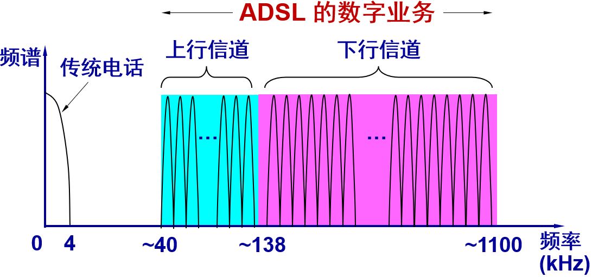

**ADSL 的数据率**

由于用户线的具体条件往往相差很大（距离、线径、受到相邻用户线的干扰程度等都不同），因此 ADSL 采用自适应调制技术使用户线能够传送尽可能高的数据率。

当 ADSL 启动时，用户线两端的 ADSL 调制解调器就测试可用的频率、各子信道受到的干扰情况，以及在每一个频率上测试信号的传输质量。

ADSL 不能保证固定的数据率。对于质量很差的用户线甚至无法开通 ADSL。

通常下行数据率在 32 kbit/s 到 6.4 Mbit/s 之间，而上行数据率在 32 kbit/s 到 640 kbit/s 之间。

**ADSL 的组成** 

基于 ADSL 的接入网的组成

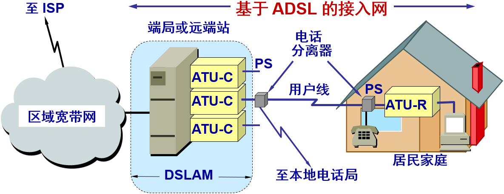

DSLAM (DSL Access Multiplexer) ：数字用户线接入复用器 
ATU (Access Termination Unit) ：接入端接单元
ATU-C (C 代表端局 Central Office) 	ATU-R (R 代表远端 Remote)
PS (POTS Splitter) ：电话分离器

**第二代 ADSL** 

包括 ADSL2（G.992.3 和 G.992.4）和 ADSL2+（G.992.5）
通过提高调制效率得到了更高的数据率。
	ADSL2 要求至少应支持下行 8 Mbit/s、上行 800 kbit/s的速率。
	ADSL2+ 则将频谱范围从 1.1 MHz 扩展至 2.2 MHz，下行速率可达 16 Mbit/s（最大传输速率可达 25 Mbit/s），而上行速率可达 800 kbit/s。
采用了无缝速率自适应技术 SRA (Seamless Rate Adaptation)，可在运营中不中断通信和不产生误码的情况下，自适应地调整数据率。
改善了线路质量评测和故障定位功能，这对提高网络的运行维护水平具有非常重要的意义。

#### 2.6.2  光纤同轴混合网（HFC网）

HFC (Hybrid Fiber Coax) 网是在目前覆盖面很广的有线电视网 CATV 的基础上开发的一种居民宽带接入网。
HFC 网除可传送 CATV 外，还提供电话、数据和其他宽带交互型业务。
现有的 CATV 网是树形拓扑结构的同轴电缆网络，它采用模拟技术的频分复用对电视节目进行单向传输。
HFC 网对 CATV 网进行了改造。 

**HFC 网的主干线路采用光纤**

HFC 网将原 CATV 网中的同轴电缆主干部分改换为光纤，并使用模拟光纤技术。
在模拟光纤中采用光的振幅调制 AM，这比使用数字光纤更为经济。
模拟光纤从头端连接到光纤结点 (fiber node)，即光分配结点 ODN (Optical Distribution Node)。在光纤结点光信号被转换为电信号。在光纤结点以下就是同轴电缆。   

**HFC 网采用结点体系结构 **

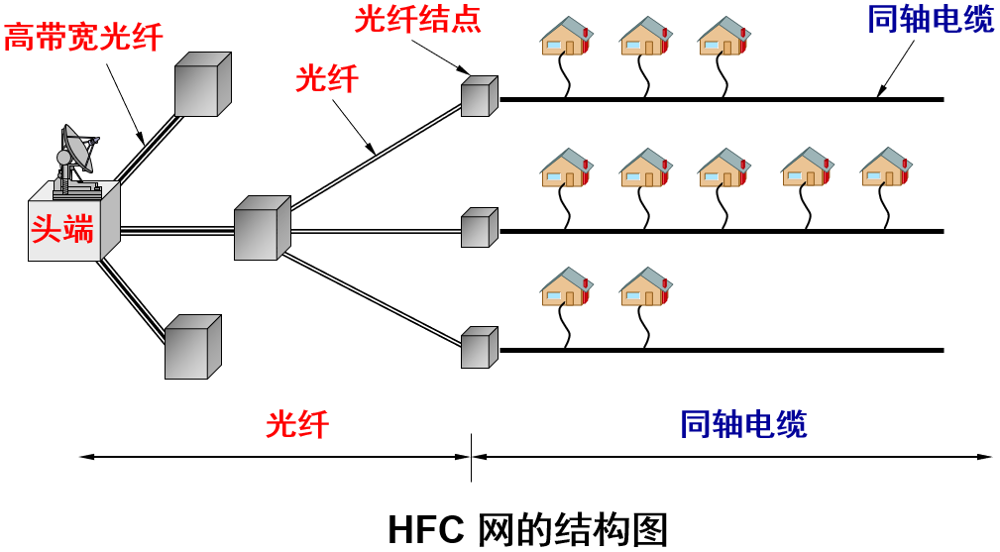

**HFC 网具有双向传输功能，扩展了传输频带**

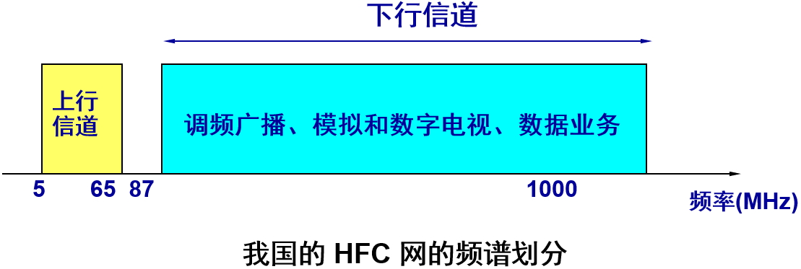

**每个家庭要安装一个用户接口盒** 

用户接口盒 UIB (User Interface Box) 要提供三种连接，即：
	使用同轴电缆连接到机顶盒 (set-top box)，然后再连接到用户的电视机。
	使用双绞线连接到用户的电话机。
	使用电缆调制解调器连接到用户的计算机。

电缆调制解调器 (Cable Modem) 

电缆调制解调器是为 HFC 网而使用的调制解调器。
电缆调制解调器最大的特点就是传输速率高。
	下行速率一般在 3  10 Mbit/s之间，最高可达 30 Mbit/s。
	上行速率一般为 0.2  2 Mbit/s，最高可达 10 Mbit/s。
电缆调制解调器比在普通电话线上使用的调制解调器要复杂得多，并且不是成对使用，而是只安装在用户端。 

#### 2.6.3  FTTx 技术

FTTx 是一种实现宽带居民接入网的方案，代表多种宽带光纤接入方式。
FTTx 表示 Fiber To The…（光纤到…），例如：
	光纤到户 FTTH (Fiber To The Home)：光纤一直铺设到用户家庭，可能是居民接入网最后的解决方法。
	光纤到大楼 FTTB (Fiber To The Building)：光纤进入大楼后就转换为电信号，然后用电缆或双绞线分配到各用户。
	光纤到路边 FTTC (Fiber To The Curb)：光纤铺到路边，从路边到各用户可使用星形结构双绞线作为传输媒体。

**无源光网络 PON (Passive Optical Network) 的组成** 

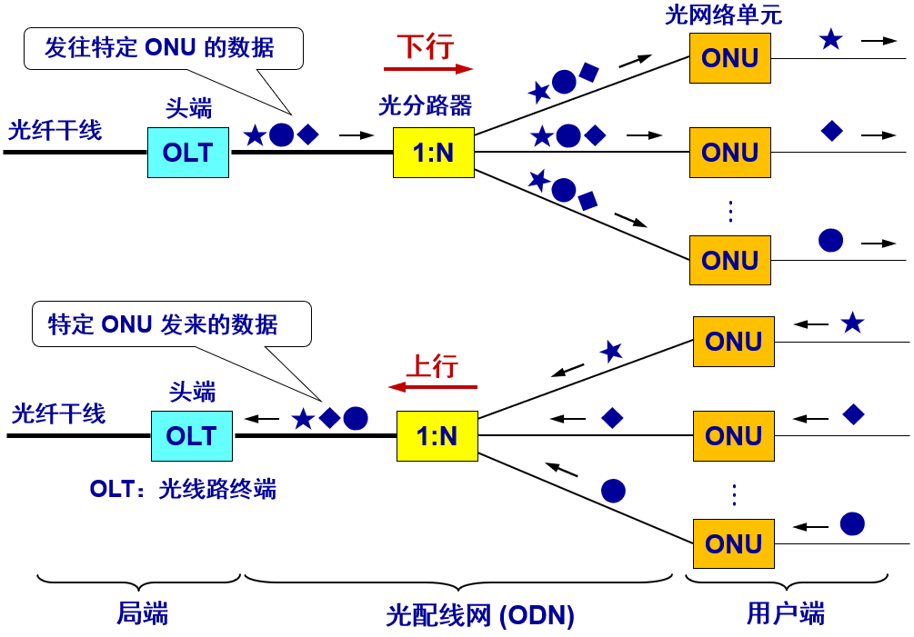
